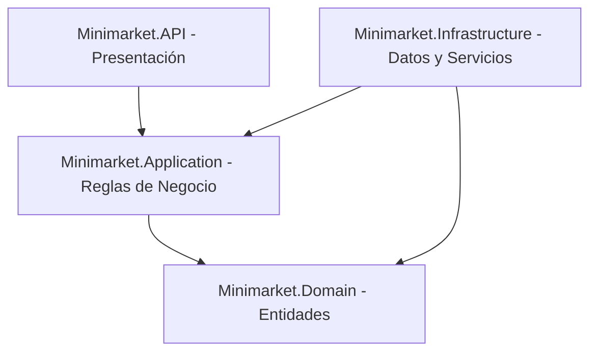

# Arquitectura y Diseño de Base de Datos - Sistema Minimarket

Este documento describe la arquitectura del backend y el esquema detallado de la base de datos del Sistema Minimarket. Está diseñado bajo el método de **Ingeniería Inversa de Requisitos** para garantizar una replicación exacta (100% de fidelidad) del sistema en cualquier entorno.

---

## 1. Arquitectura del Sistema (Clean Architecture)

El backend está desarrollado en .NET Core utilizando **Arquitectura Limpia**, lo que separa las responsabilidades en cuatro capas bien definidas con flujo de dependencia hacia el interior (el Dominio).



### Capas del Proyecto:
1. **`Minimarket.Domain`**: Contiene las entidades puras del dominio mapeadas directamente a las tablas de la base de datos. No tiene dependencias externas.
2. **`Minimarket.Application`**: Define los contratos de servicios (interfaces) y los objetos de transferencia de datos (DTOs).
3. **`Minimarket.Infrastructure`**: Implementa el acceso a datos mediante Entity Framework Core (`DbMinimarketContext.cs`) y la lógica de negocio concreta en los servicios.
4. **`Minimarket.API`**: Expone los endpoints HTTP a través de controladores y maneja la autenticación, configuración de CORS y documentación OpenAPI (NSwag).

---

## 2. Esquema Relacional de la Base de Datos (DDL)

El sistema utiliza **Microsoft SQL Server**. A continuación se detalla el script SQL estructurado para recrear la base de datos con sus respectivas llaves primarias, llaves foráneas, índices y restricciones de unicidad.

```sql
-- 1. TABLAS MAESTRAS (Sin dependencias externas)

CREATE TABLE [Categoria] (
    [id] INT NOT NULL IDENTITY,
    [nombre] VARCHAR(100) NOT NULL,
    CONSTRAINT [PK_Categoria] PRIMARY KEY ([id])
);

CREATE TABLE [Cliente] (
    [id] INT NOT NULL IDENTITY,
    [documento] VARCHAR(20) NOT NULL,
    [nombre] VARCHAR(150) NOT NULL,
    [limiteCredito] DECIMAL(10,2) NULL DEFAULT 0.0,
    [saldoDeudor] DECIMAL(10,2) NULL DEFAULT 0.0,
    CONSTRAINT [PK_Cliente] PRIMARY KEY ([id]),
    CONSTRAINT [UQ_Cliente_Documento] UNIQUE ([documento])
);

CREATE TABLE [LogAuditoria] (
    [id] INT NOT NULL IDENTITY,
    [fechaHora] DATETIME NOT NULL,
    [accion] VARCHAR(100) NOT NULL,
    [detalles] VARCHAR(MAX) NULL,
    CONSTRAINT [PK_LogAuditoria] PRIMARY KEY ([id])
);

CREATE TABLE [Proveedor] (
    [id] INT NOT NULL IDENTITY,
    [ruc] VARCHAR(20) NOT NULL,
    [razonSocial] VARCHAR(150) NOT NULL,
    [telefono] VARCHAR(20) NULL,
    [direccion] VARCHAR(255) NULL,
    CONSTRAINT [PK_Proveedor] PRIMARY KEY ([id]),
    CONSTRAINT [UQ_Proveedor_RUC] UNIQUE ([ruc])
);

CREATE TABLE [Usuario] (
    [id] INT NOT NULL IDENTITY,
    [nombre] VARCHAR(100) NOT NULL,
    [username] VARCHAR(50) NOT NULL,
    [contrasena] VARCHAR(255) NOT NULL,
    [rol] VARCHAR(20) NOT NULL, -- Valores válidos: 'Administrador', 'Cajero'
    CONSTRAINT [PK_Usuario] PRIMARY KEY ([id]),
    CONSTRAINT [UQ_Usuario_Username] UNIQUE ([username])
);

-- 2. TABLAS SECUNDARIAS (Con dependencias de nivel 1)

CREATE TABLE [Producto] (
    [id] INT NOT NULL IDENTITY,
    [codigoBarras] VARCHAR(50) NULL,
    [nombre] VARCHAR(100) NOT NULL,
    [precioCosto] DECIMAL(10,2) NOT NULL,
    [precioVenta] DECIMAL(10,2) NOT NULL,
    [stockActual] INT NOT NULL,
    [stockMinimo] INT NOT NULL,
    [fechaVencimiento] DATETIME2 NULL,
    [categoria_id] INT NOT NULL,
    CONSTRAINT [PK_Producto] PRIMARY KEY ([id]),
    CONSTRAINT [FK_Producto_Categoria] FOREIGN KEY ([categoria_id]) REFERENCES [Categoria] ([id]),
    CONSTRAINT [UQ_Producto_CodigoBarras] UNIQUE ([codigoBarras]) WHERE [codigoBarras] IS NOT NULL
);

CREATE TABLE [Compra] (
    [id] INT NOT NULL IDENTITY,
    [proveedor_id] INT NOT NULL,
    [nroDocumento] VARCHAR(50) NULL,
    [fecha] DATETIME NOT NULL,
    [total] DECIMAL(10,2) NOT NULL,
    CONSTRAINT [PK_Compra] PRIMARY KEY ([id]),
    CONSTRAINT [FK_Compra_Proveedor] FOREIGN KEY ([proveedor_id]) REFERENCES [Proveedor] ([id])
);

CREATE TABLE [SesionCaja] (
    [id] INT NOT NULL IDENTITY,
    [fechaApertura] DATETIME NOT NULL,
    [montoApertura] DECIMAL(10,2) NOT NULL,
    [montoCierreReal] DECIMAL(10,2) NULL,
    [usuario_id] INT NULL,
    CONSTRAINT [PK_SesionCaja] PRIMARY KEY ([id]),
    CONSTRAINT [FK_SesionCaja_Usuario] FOREIGN KEY ([usuario_id]) REFERENCES [Usuario] ([id])
);

CREATE TABLE [AjusteStock] (
    [id] INT NOT NULL IDENTITY,
    [producto_id] INT NOT NULL,
    [tipo] VARCHAR(20) NOT NULL, -- Valores válidos: 'Ingreso', 'Salida'
    [cantidad] INT NOT NULL,
    [justificacion] VARCHAR(255) NULL,
    [fecha] DATETIME NOT NULL,
    CONSTRAINT [PK_AjusteStock] PRIMARY KEY ([id]),
    CONSTRAINT [FK_AjusteStock_Producto] FOREIGN KEY ([producto_id]) REFERENCES [Producto] ([id])
);

CREATE TABLE [CuentaPorPagar] (
    [id] INT NOT NULL IDENTITY,
    [proveedor_id] INT NOT NULL,
    [compra_id] INT NULL,
    [montoTotal] DECIMAL(10,2) NOT NULL,
    [saldoPendiente] DECIMAL(10,2) NOT NULL,
    CONSTRAINT [PK_CuentaPorPagar] PRIMARY KEY ([id]),
    CONSTRAINT [FK_CuentaPorPagar_Proveedor] FOREIGN KEY ([proveedor_id]) REFERENCES [Proveedor] ([id]),
    CONSTRAINT [FK_CuentaPorPagar_Compra] FOREIGN KEY ([compra_id]) REFERENCES [Compra] ([id])
);

CREATE TABLE [DetalleCompra] (
    [compra_id] INT NOT NULL,
    [producto_id] INT NOT NULL,
    [cantidad] INT NOT NULL,
    [precioCosto] DECIMAL(10,2) NOT NULL,
    CONSTRAINT [PK_DetalleCompra] PRIMARY KEY ([compra_id], [producto_id]),
    CONSTRAINT [FK_DetalleCompra_Compra] FOREIGN KEY ([compra_id]) REFERENCES [Compra] ([id]),
    CONSTRAINT [FK_DetalleCompra_Producto] FOREIGN KEY ([producto_id]) REFERENCES [Producto] ([id])
);

-- 3. TABLAS TRANSACCIONALES DE VENTAS (Con dependencias de nivel 2 o superior)

CREATE TABLE [Venta] (
    [id] INT NOT NULL IDENTITY,
    [sesion_caja_id] INT NOT NULL,
    [cliente_id] INT NULL,
    [fechaHora] DATETIME NOT NULL,
    [total] DECIMAL(10,2) NOT NULL,
    [metodoPago] VARCHAR(20) NOT NULL, -- Valores: 'EFECTIVO', 'TARJETA', 'CREDITO'
    [estado] VARCHAR(20) NOT NULL, -- Valores: 'Completada', 'Anulada'
    CONSTRAINT [PK_Venta] PRIMARY KEY ([id]),
    CONSTRAINT [FK_Venta_SesionCaja] FOREIGN KEY ([sesion_caja_id]) REFERENCES [SesionCaja] ([id]),
    CONSTRAINT [FK_Venta_Cliente] FOREIGN KEY ([cliente_id]) REFERENCES [Cliente] ([id])
);

CREATE TABLE [ComprobantePago] (
    [id] INT NOT NULL IDENTITY,
    [venta_id] INT NOT NULL,
    [nroComprobante] VARCHAR(50) NOT NULL,
    [tipo] VARCHAR(20) NOT NULL, -- Valores: 'Boleta', 'Factura'
    CONSTRAINT [PK_ComprobantePago] PRIMARY KEY ([id]),
    CONSTRAINT [FK_ComprobantePago_Venta] FOREIGN KEY ([venta_id]) REFERENCES [Venta] ([id])
);

CREATE TABLE [CreditoCliente] (
    [id] INT NOT NULL IDENTITY,
    [cliente_id] INT NOT NULL,
    [venta_id] INT NULL,
    [montoTotal] DECIMAL(10,2) NOT NULL,
    [saldoPendiente] DECIMAL(10,2) NOT NULL,
    CONSTRAINT [PK_CreditoCliente] PRIMARY KEY ([id]),
    CONSTRAINT [FK_CreditoCliente_Cliente] FOREIGN KEY ([cliente_id]) REFERENCES [Cliente] ([id]),
    CONSTRAINT [FK_CreditoCliente_Venta] FOREIGN KEY ([venta_id]) REFERENCES [Venta] ([id])
);

CREATE TABLE [DetalleVenta] (
    [venta_id] INT NOT NULL,
    [producto_id] INT NOT NULL,
    [cantidad] INT NOT NULL,
    [precioUnitario] DECIMAL(10,2) NOT NULL,
    [subtotal] DECIMAL(10,2) NOT NULL,
    CONSTRAINT [PK_DetalleVenta] PRIMARY KEY ([venta_id], [producto_id]),
    CONSTRAINT [FK_DetalleVenta_Venta] FOREIGN KEY ([venta_id]) REFERENCES [Venta] ([id]),
    CONSTRAINT [FK_DetalleVenta_Producto] FOREIGN KEY ([producto_id]) REFERENCES [Producto] ([id])
);

CREATE TABLE [AbonoCliente] (
    [id] INT NOT NULL IDENTITY,
    [credito_cliente_id] INT NOT NULL,
    [fecha] DATETIME NOT NULL,
    [monto] DECIMAL(10,2) NOT NULL,
    CONSTRAINT [PK_AbonoCliente] PRIMARY KEY ([id]),
    CONSTRAINT [FK_AbonoCliente_CreditoCliente] FOREIGN KEY ([credito_cliente_id]) REFERENCES [CreditoCliente] ([id])
);

-- 4. ÍNDICES DE OPTIMIZACIÓN
CREATE INDEX [IX_AbonoCliente_credito_cliente_id] ON [AbonoCliente] ([credito_cliente_id]);
CREATE INDEX [IX_AjusteStock_producto_id] ON [AjusteStock] ([producto_id]);
CREATE INDEX [IX_Compra_proveedor_id] ON [Compra] ([proveedor_id]);
CREATE INDEX [IX_ComprobantePago_venta_id] ON [ComprobantePago] ([venta_id]);
CREATE INDEX [IX_CreditoCliente_cliente_id] ON [CreditoCliente] ([cliente_id]);
CREATE INDEX [IX_CreditoCliente_venta_id] ON [CreditoCliente] ([venta_id]);
CREATE INDEX [IX_CuentaPorPagar_compra_id] ON [CuentaPorPagar] ([compra_id]);
CREATE INDEX [IX_CuentaPorPagar_proveedor_id] ON [CuentaPorPagar] ([proveedor_id]);
CREATE INDEX [IX_DetalleCompra_producto_id] ON [DetalleCompra] ([producto_id]);
CREATE INDEX [IX_DetalleVenta_producto_id] ON [DetalleVenta] ([producto_id]);
CREATE INDEX [IX_Producto_categoria_id] ON [Producto] ([categoria_id]);
CREATE INDEX [IX_SesionCaja_usuario_id] ON [SesionCaja] ([usuario_id]);
CREATE INDEX [IX_Venta_cliente_id] ON [Venta] ([cliente_id]);
CREATE INDEX [IX_Venta_sesion_caja_id] ON [Venta] ([sesion_caja_id]);
```

---

## 3. Mapeo de Entidades (Entity Mapping)

El contexto de base de datos (`DbMinimarketContext.cs`) utiliza **Fluent API** en Entity Framework Core para asegurar el mapeo exacto de nombres de tablas y columnas (evitando la pluralización en español).

### Ejemplo de Configuración Clave:
```csharp
modelBuilder.Entity<Producto>(entity =>
{
    entity.ToTable("Producto");
    entity.HasKey(e => e.Id);
    entity.Property(e => e.Nombre).HasMaxLength(100).IsRequired();
    entity.Property(e => e.PrecioCosto).HasColumnType("decimal(10, 2)");
    entity.Property(e => e.PrecioVenta).HasColumnType("decimal(10, 2)");
    entity.HasOne(d => d.Categoria)
          .WithMany(p => p.Productos)
          .HasForeignKey(d => d.CategoriaId)
          .HasConstraintName("FK_Producto_Categoria");
});
```
